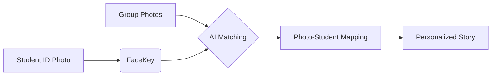

# SchoolMee: AI-Powered Personalized Graduation Album Service

### "학교의 모든 사진을 자동으로 분석해, 학생 한 명 한 명의 이야기를 만들어주는 AI 졸업 앨범 플랫폼"

SchoolMee는 다수의 학급 단체 사진 속에서 학생 개개인의 얼굴을 AI로 식별하고, 각 학생만의 고유한 성장 서사가 담긴 개인 맞춤형 졸업 앨범을 생성하는 플랫폼입니다. 

---

## 🚀 1. Start Here (빠른 시작 가이드)

평가자께서는 아래 순서에 따라 프로젝트를 즉시 실행하고 검증하실 수 있습니다.

1.  **실행**: `cp .env.example .env` 후 `docker-compose up --build -d` 실행
2.  **접속**: `http://localhost:5173` 접속
3.  **데이터 생성**: 메인 화면의 **[Quick Start]** 버튼 클릭 (샘플 학교/학생/사진 자동 생성)
4.  **결과 확인**: 학생 상세 페이지에서 AI가 자동 생성한 **개인별 스토리 타임라인** 확인

---

## 🧠 2. How It Works (핵심 동작 흐름)

SchoolMee의 데이터 처리 파이프라인은 아래와 같은 단계로 유기적으로 연결됩니다.

1.  **Registration**: 학생 등록 시 업로드된 증명사진을 분석하여 고유 **FaceKey** 생성
2.  **Ingestion**: 학급의 대량 단체 사진 업로드 및 서버 저장
3.  **Matching**: AI 엔진이 단체 사진 속 얼굴들을 추출, 학생별 FaceKey와 대조하여 **PhotoStudent** 관계 생성 (N:M 매핑)
4.  **Composition**: 매칭된 사진들을 시간순/주제별로 그룹화하여 학생별 **Story(타임라인)** 자동 구성



---

## 📦 3. Image Handling & Storage

이미지 데이터의 보안 및 효율적인 서빙을 위해 아래와 같은 구조를 사용합니다.

- **업로드 위치**: 컨테이너 내부 `/app/uploads` (호스트의 `./schoolMee-BE/uploads`와 볼륨 매핑)
- **서빙 방식**: 보안상의 이유로 브라우저의 직접적인 `file://` 접근을 차단하고, 백엔드의 전용 리소스 핸들러를 통해 `http://localhost:8080/uploads/...` 형태로 안전하게 서빙합니다.
- **추상화**: `StorageService` 인터페이스를 통해 향후 코드 변경 없이 **AWS S3** 등 클라우드 스토리지로의 즉시 전환이 가능합니다.

---

## 🧪 4. Verification Test Scenarios (검증 절차)

1.  **Onboarding**: `Quick Start` 버튼 클릭으로 테스트 환경 즉시 구축
2.  **FaceKey 생성**: 학생 상세 페이지에서 증명사진 기반 고유 식별키 생성 확인
3.  **AI Pipeline**: 단체 사진 업로드 후 `Analyze` 버튼을 통해 매칭 로직 구동 (N:M 매핑 생성)
4.  **Story Timeline**: 학생별로 본인이 포함된 사진들만 필터링되어 시간순으로 나열되는지 확인
5.  **Data Portability**: 학급 데이터 JSON Export 기능을 통한 데이터 무결성 검증

---

## ⚠️ 5. Known Limitations (학술적 고찰)

실제 서비스 런칭 시 개선이 필요한 알려진 한계점입니다.

- **Mock AI**: 현재는 시뮬레이션 기반 엔진을 사용 중이며, 실제 환경에서는 AWS Rekognition 등의 외부 API 연동이 필요합니다.
- **동명이인 처리**: 현재 학생 식별은 고유 ID 기반이나, UI상에서 동명이인 발생 시 시각적 구분 처리가 보완되어야 합니다.
- **처리 성능**: 대용량 사진 업로드 및 분석 시 동기(Synchronous) 방식으로 처리되므로, 향후 Kafka 등을 이용한 비동기 Worker 구조로의 개선이 필요합니다.

---

## 💡 6. Engineering Rationale

- **N:M Mapping**: 한 사진에 여러 학생, 한 학생이 여러 사진에 등장하는 관계를 `PhotoStudent` 연결 엔티티로 최적화
- **Separation of Concerns**: UI, API, Business Logic, Data Access, Infrastructure를 철저히 분리
- **Infrastructure as Code**: Docker Compose를 활용하여 로컬 개발 환경과 실제 운영 환경의 일관성 확보

---

## 🛠 7. Requirements & Setup

- **Requirements**: Docker Engine 20.10+, Docker Compose V2+
- **Setup**:
    ```bash
    cp .env.example .env
    docker-compose up --build -d
    ```
- **Structure**:
    - `schoolMee-BE`: Spring Boot (Java 17, Gradle)
    - `schoolMee-FE`: React (TypeScript, Vite)
    - `db`: PostgreSQL 15
